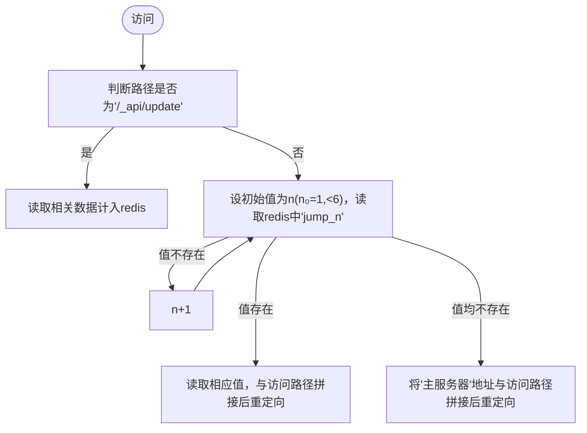
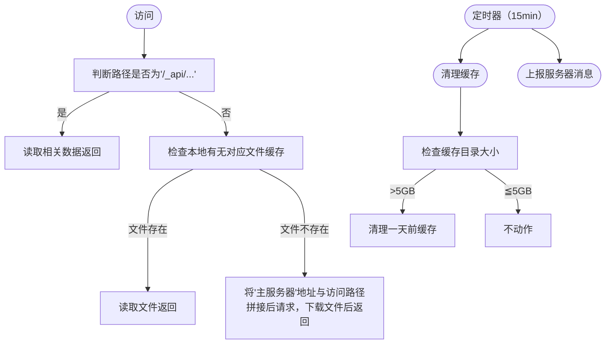

### 前言



一直以来，我都在尝试各种图片存储方案，一开始便是经典的Github+jsd，但考虑到违反了tos后面就用了cf+b2，但速度不尽人意。后来用了vercel反代gh和一些杂七杂八的，但换汤不换药嘛，还是不靠谱。

<!-- more -->

在差不多一年前，我在捣鼓网心云时想到个主意：何不用家里电脑作为图片存储，通过非标准端口访问绕过备案要求。于是在[随记](https://notes.hzchu.top/)上提出个简易pcdn的想法



不过像我这种小站没必要搞那么重量级了，于是改进了下

### 思路



首先，本质上是个缓存服务，存储在OneDrive（下文简称od），通过各个节点分发图片，~~就是给od套了个CDN嘛~~。

因为我这网站也没多少流量，并发不高，我更倾向葫芦娃救爷爷式的单节点当主力，挂了再切换到其它节点的方式。

最后就是轻量，加上安全性问题总不能把od下放到每个节点吧。

故：

1. 设立一个“主服务器”，用来将od的内容分发到节点，可以用无服务器函数，也可以直接和”图床服务器“合并。同时因为服务器间同步有延时，在”图床服务器“要留个口直接下载刚刚上传的图片。
2. 设立一个”副服务器“，负责检测节点状况和跳转到对应节点。
3. ”图床服务器“：使用lsky-pro作为图床程序，将od使用rclone挂载到对应的存储策略文件夹上。
4. 节点：获取访问的链接，检查本地有无缓存，有就返回，没有就下载再返回。考虑到要用php的话配置起来麻烦，直接用py了。


### 准备

1. 服务器 >=1台，最好是访问速度快的
2. 一个微软账户（我这里用的是E5订阅账户）
3. *有公网IP的家庭宽带（可选）*

在od中新建`/share/mount`目录，若自行更改请注意将下文涉及的地方一起修改

推荐使用Linux，如果使用Windows下文操作将有所不同，需自行更改

### 安装（图床服务器）

首先完成“图床服务器”的搭建。

#### 前置

##### libfuse

安装`meson ninja`

```bash
pip3 install meson ninja
```



从 https://github.com/libfuse/libfuse/releases 下载libfuse的源码

解压，创建一个（临时）构建目录，然后 运行`meson`

```bash
tar xzf fuse-3.15.1.tar.gz; cd fuse-3.15.1/
mkdir build; cd build
meson setup ..
```

> 3.15.1 替换为对应的releases版本

运行`ninja`进行安装

```bash
sudo ninja install
```

##### rclone

安装：

```bash
curl https://rclone.org/install.sh | sudo bash
```

> 同时在本地也要安装，用来获取token

在本地运行rclone config进行配置



把token复制出来备用（token包括两端的{}）



在服务端进行同样的操作，但在`Edit advanced config`中填`y`






然后一路回车，在`Already have a token - refresh?`填`n`

然后按要求填写



> 会自动获取drive_id,drive_type，不要回车太快按过了

挂载试试吧

```bash
mkdir mount
rclone mount one:/share/mount/ ./mount/
```

不出意外你能看见这个报错



打开报错涉及的文件，取消注释，保存



再试下，如果没报错就可以了



> 新建的mount文件夹在下文没有作用，建议删除~
>
> 使用fusermount -qzu mount 卸载

##### LNMP

不用多说

#### 配置

##### 图床本体

我这里用的是[Lsky Pro](https://docs.lsky.pro/docs/free/v2/quick-start/installation.html)作为图床程序，其他大同小异

按照文档安装好后，新建一个**本地**存储策略，访问地址指向“副服务器”，并在后面加上`/mount`，存储路径根据自己的网站路径来，如`/www/wwwroot/pic.hzchu.top/`就填`/www/wwwroot/pic.hzchu.top/storage/app/mount/`



> 记得更改&新建相应目录

##### Rclone

rclone需要持久化运行，我这里建议的是Supervisor或系统自带的systemd，windows使用nssm

```bash
rclone mount one:/share/mount/ /www/wwwroot/pic.hzchu.top/storage/app/mount/ --copy-links --no-gzip-encoding --no-check-certificate --allow-other --allow-non-empty --umask 000 --vfs-cache-mode full --attr-timeout 15m --vfs-cache-max-age 240h --vfs-cache-max-size 1G --buffer-size 100M
```

<!-- tab supervisor -->

以宝塔面板为例

打开`软件商店`，搜索并安装`进程守护管理器`：

点击`添加守护进程`，如图所示


<!-- tab systemd -->

运行：

```bash
sudo vim /etc/systemd/system/rclone-one.service
```

​	写入：

```bash
[Unit]
Description=rclone-one
After=network.target remote-fs.target nss-lookup.target

[Service]
User=root
ExecStart=rclone mount one:/share/mount/ /www/wwwroot/pic.hzchu.top/storage/app/mount/ --copy-links --no-gzip-encoding --no-check-certificate --allow-other --allow-non-empty --umask 000 --vfs-cache-mode full --attr-timeout 15m --vfs-cache-max-age 240h --vfs-cache-max-size 1G --buffer-size 100M
ExecReload=/bin/kill -s HUP $MAINPID
ExecStop=/bin/kill -s QUIT $MAINPID
Restart=on-abnormal
RestartSec=5s

[Install]
WantedBy=multi-user.target
```

### 安装（主服务器）

可以用无服务器函数，这里使用[onedrive-vercel-index](https://github.com/spencerwooo/onedrive-vercel-index)作为OneDrive的直链解析，[这里](https://ovi.swo.moe/zh/docs/getting-started)是它的文档

将`baseDirectory`设为`/share`



由于原作者的应用程序已过期，需要自行配置，参考[高级 - OneDrive Vercel Index (swo.moe)](https://ovi.swo.moe/zh/docs/advanced#使用你自己的-client-id-与-secret)进行调整

> 由于`vercel.app`在国内污染严重，请绑定你的域名

### 中途 ~~开香槟~~ 测试

1. 在图床中上传一张图片，查看是否上传成功，若出现错误，则检查图床服务器
2. 等待5分钟后访问`https://yourdomain.top/zh-CN/mount/`，查看是否出现`pic`文件夹，并根据`年/月/日`进入子文件夹查看能否访问图片





### 安装（副服务器）

需要安装redis，故不推荐使用虚拟主机，但非要用可以使用Vercel的[Durable Redis](https://vercel.com/dashboard/stores)

> **注：**
>
> jumpurl为该节点的对外访问地址
>
> apiurl 为“副服务器”的对外访问地址
>
> backupurl 为“图床服务器“的对外访问地址
>
> mainurl 为“主服务器“的对外访问地址




<!-- tab PHP版本 -->

> 需要修改redis连接地址，`$user_token`和`$mainurl`

Code:



伪静态配置:

```nginx
location / {
    try_files $uri $uri/ /index.php?$args;
}
```
<!-- tab Python版本 -->
Code:

> 需要修改redis连接地址，`user_token` 和` mainurl`

安装依赖：

```bash
pip3 install flask flask_limiter hypercorn flask_cors
```



<!-- tab 解析 -->

运行逻辑：






1. 接受服务器状态：相比于主动检测，被动式显然更简单。通过向`/_api/update`发送`POST`请求(json)，内容包括`token,server_id,url`，server_id是阿拉伯数字，url是节点的对外访问地址，将存入redis中，20分钟过期
2. `/*`の跳转：在请求图片时，会把1-5的数字往挨个请求[如果有更多节点可以更改]，如果有值，则取该值与访问地址拼接后，返回重定向请求。如果无节点在线，则将主服务器地址与访问地址拼接再返回。
3. 均有访问速率限制，防止被人打到爆炸，可以根据实际情况调节上限。



在搭建完成后，测试访问之前上传的图片，如果能返回图片即ok

### 节点

考虑到php部署起来麻烦，这里用python解决一切



在arm设备上配环境配半天，一气之下用go重写了主要逻辑，编译成二进制文件到处丢太爽了




<!-- tab Python -->

下载数据库到程序同目录：[[点击下载]](https://raw.hzchu.top/thun888/MNSLXOD/main/node/data.db)

安装依赖：

```bash
pip3 install flask flask_limiter hypercorn flask_cors
```

Code:



> 节点附带了两个简易api用于查看该节点运行情况
>
> 实际部署中可能需要自行配置ssl证书以使开启了https的网站可以正常访问
>
> 如果外部不套反向代理建议自定义10000-65535的端口
>
> 进程同样需要持久化，可以参考rclone部分

<!-- tab 解析 -->







### 效果


<!-- tab 直接访问OneDrive目录程序 -->

低并发



高并发



<!-- tab 正常访问效果 -->

低并发



高并发



<!-- tab 直接访问家宽节点 -->

低并发



高并发



<!-- tab 搭配Nginx缓存 -->

高并发






### 结语

对应这个项目，我感觉就是：`易上手，易扩展`同时可以薅到各大厂商的羊毛（怎么薅就看各位的了），既可以把一些不稳定的服务利用起来，又不用担心出问题时全部拉闸，并且背靠微软不用担心无良厂商跑路数据丢失，当然，在目前只能算的上是一个高可用性的小型cdn，比起pcdn还有不少不足，但个人使用足以。

而关于利用国内宽带在未备案情况下提供网络服务的问题，我想联通与其抓我这1个月200MB上传的小服务，不如去抓那些狗大户，更重要的是图床时自用的，不用担心因为有人上传违法色情的图片被请去喝茶。

该项目也可以用在别的地方，自行发挥啦

项目开源地址：




ps：

从4月份到现在为od节省了17倍的数据



从4月份到现在的日志

共480多条，大多数都是爬虫的贡献