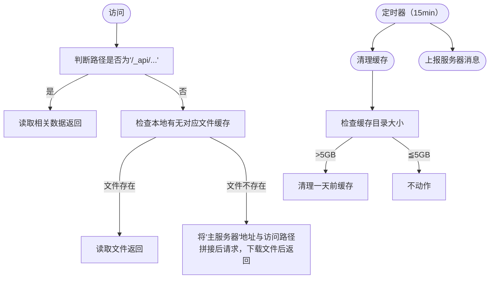

### 前言

一直以来，我都在尝试各种图片存储方案，一开始便是经典的Github+jsd，但考虑到违反了tos后面就用了cf+b2，但速度不尽人意。后来用了vercel反代gh和一些杂七杂八的，但换汤不换药嘛，还是不靠谱。

<!-- more -->

在差不多一年前，我在捣鼓网心云时想到个主意：何不用家里电脑作为图片存储，通过非标准端口访问绕过备案要求。于是在[随记](https://notes.hzchu.top/)上提出个简易pcdn的想法


不过像我这种小站没必要搞那么重量级了，于是改进了下

### 思路


首先，本质上是个缓存服务，存储在OneDrive（下文简称od），通过各个节点分发图片，~~就是给od套了个CDN嘛~~。

因为我这网站也没多少流量，并发不高，我更倾向葫芦娃救爷爷式的单节点当主力，挂了再切换到其它节点的方式。

最后就是轻量，总不能把od下放到每个节点吧。

故：

1. 设立一个“主服务器”，用来将od的内容分发到节点，可以用无服务器函数，也可以直接和”图床服务器“合并。同时因为服务器间同步有延时，在”图床服务器“要留个口直接下载刚刚上传的图片。
2. 设立一个”副服务器“，负责检测节点状况和跳转到对应节点。
3. ”图床服务器“：使用lsky-pro作为图床程序，将od使用rclone挂载到对应的存储策略文件夹上。
4. 节点：获取访问的链接，检查本地有无缓存，有就返回，没有就下载再返回。考虑到要用php的话配置起来麻烦，直接用py了。


### 准备

1. 服务器 >=1台，最好是访问速度快的
2. 一个微软账户（我这里用的是E5订阅账户）
3. *有公网IP的家庭宽带（可选）*

在od中新建`/share/mount`目录，若自行更改请注意将下文涉及的地方一起修改

推荐使用Linux，如果使用Windows下文操作将有所不同，需自行更改

### 安装（图床服务器）

首先完成“图床服务器”的搭建。

#### 前置

##### libfuse

安装`meson ninja`

```bash
pip3 install meson ninja
```



从 https://github.com/libfuse/libfuse/releases 下载libfuse的源码

解压，创建一个（临时）构建目录，然后 运行`meson`

```bash
tar xzf fuse-3.15.1.tar.gz; cd fuse-3.15.1/
mkdir build; cd build
meson setup ..
```

> 3.15.1 替换为对应的releases版本

运行`ninja`进行安装

```bash
sudo ninja install
```

##### rclone

安装：

```bash
curl https://rclone.org/install.sh | sudo bash
```

> 同时在本地也要安装，用来获取token

在本地运行rclone config进行配置


把token复制出来备用（token包括两端的{}）


在服务端进行同样的操作，但在`Edit advanced config`中填`y`


然后一路回车，在`Already have a token - refresh?`填`n`

然后按要求填写


> 会自动获取drive_id,drive_type，不要回车太快按过了

挂载试试吧

```bash
mkdir mount
rclone mount one:/share/mount/ ./mount/
```

不出意外你能看见这个报错


打开报错涉及的文件，取消注释，保存


再试下，如果没报错就可以了


> 新建的mount文件夹在下文没有作用，建议删除~
>
> 使用fusermount -qzu mount 卸载

##### LNMP

不用多说

#### 配置

##### 图床本体

我这里用的是[Lsky Pro](https://docs.lsky.pro/docs/free/v2/quick-start/installation.html)作为图床程序，其他大同小异

按照文档安装好后，新建一个**本地**存储策略，访问地址指向“副服务器”，并在后面加上`/mount`，存储路径根据自己的网站路径来，如`/www/wwwroot/pic.hzchu.top/`就填`/www/wwwroot/pic.hzchu.top/storage/app/mount/`


> 记得更改&新建相应目录

##### Rclone

rclone需要持久化运行，我这里建议的是Supervisor或系统自带的systemd，windows使用nssm

```bash
rclone mount one:/share/mount/ /www/wwwroot/pic.hzchu.top/storage/app/mount/ --copy-links --no-gzip-encoding --no-check-certificate --allow-other --allow-non-empty --umask 000 --vfs-cache-mode full --attr-timeout 15m --vfs-cache-max-age 240h --vfs-cache-max-size 1G --buffer-size 100M
```

<!-- tab supervisor -->

以宝塔面板为例

打开`软件商店`，搜索并安装`进程守护管理器`：

点击`添加守护进程`，如图所示


<!-- tab systemd -->

运行：

```bash
sudo vim /etc/systemd/system/rclone-one.service
```

​	写入：

```bash
[Unit]
Description=rclone-one
After=network.target remote-fs.target nss-lookup.target

[Service]
User=root
ExecStart=rclone mount one:/share/mount/ /www/wwwroot/pic.hzchu.top/storage/app/mount/ --copy-links --no-gzip-encoding --no-check-certificate --allow-other --allow-non-empty --umask 000 --vfs-cache-mode full --attr-timeout 15m --vfs-cache-max-age 240h --vfs-cache-max-size 1G --buffer-size 100M
ExecReload=/bin/kill -s HUP $MAINPID
ExecStop=/bin/kill -s QUIT $MAINPID
Restart=on-abnormal
RestartSec=5s

[Install]
WantedBy=multi-user.target
```

### 安装（主服务器）

可以用无服务器函数，这里使用[onedrive-vercel-index](https://github.com/spencerwooo/onedrive-vercel-index)作为OneDrive的直链解析，[这里](https://ovi.swo.moe/zh/docs/getting-started)是它的文档

将`baseDirectory`设为`/share`


由于原作者的应用程序已过期，需要自行配置，参考[高级 - OneDrive Vercel Index (swo.moe)](https://ovi.swo.moe/zh/docs/advanced#使用你自己的-client-id-与-secret)进行调整

> 由于`vercel.app`在国内污染严重，请绑定你的域名

### 中途 ~~开香槟~~ 测试

1. 在图床中上传一张图片，查看是否上传成功，若出现错误，则检查图床服务器
2. 等待5分钟后访问`https://yourdomain.top/zh-CN/mount/`，查看是否出现`pic`文件夹，并根据`年/月/日`进入子文件夹查看能否访问图片


### 安装（副服务器）

需要安装redis，故不推荐使用虚拟主机，但非要用可以使用Vercel的[Durable Redis](https://vercel.com/dashboard/stores)

> **注：**
>
> jumpurl为该节点的对外访问地址
>
> apiurl 为“副服务器”的对外访问地址
>
> backupurl 为“图床服务器“的对外访问地址
>
> mainurl 为“主服务器“的对外访问地址




<!-- tab PHP版本 -->

> 需要修改redis连接地址，$user_token和$mainurl

Code:

```php
<?php
// 连接 Redis 服务器
$redis = new Redis();
$redis->connect('127.0.0.1', 6379);
$redis->select(2);
//token
$user_token = "yourtoken";
//主服务器url
$mainurl = "https://yourdomain.top/api/raw/?path=/";

// 定义限制器类
class Limiter {
    private $limits;
    private $key_func;
    private $requests;

    public function __construct($key_func, $default_limits) {
        $this->limits = $default_limits;
        $this->key_func = $key_func;
        $this->requests = array();
    }

    public function limit($route, $limit) {
        if (!isset($this->requests[$route])) {
            $this->requests[$route] = array();
        }
        $key = call_user_func($this->key_func);
        if (!isset($this->requests[$route][$key])) {
            $this->requests[$route][$key] = array();
        }
        array_push($this->requests[$route][$key], time());
        while (count($this->requests[$route][$key]) > 0 && time() - $this->requests[$route][$key][0] > 1) {
            array_shift($this->requests[$route][$key]);
        }
        if (count($this->requests[$route][$key]) > $limit) {
            http_response_code(429);
            die('Too Many Requests');
        }
    }
}

// 定义获取客户端 IP 地址的函数
function get_remote_address() {
    return $_SERVER['REMOTE_ADDR'];
}

// 初始化限制器
$limiter = new Limiter('get_remote_address', array('40 per second'));


// 定义 update 路由
if ($_SERVER['REQUEST_METHOD'] === 'POST' && $_SERVER['REQUEST_URI'] === '/_api/update') {
    // 检查请求速率
    $limiter->limit('/_api/update', 5);

    // 获取请求参数
    $json = json_decode(file_get_contents('php://input'), true);
    $token = isset($json['token']) ? $json['token'] : null;
    $server_id = isset($json['server_id']) ? $json['server_id'] : null;
    $url = isset($json['url']) ? $json['url'] : null;

    // 检查参数完整性
    if (!$token || !$server_id || !$url) {
        http_response_code(400);
        die(json_encode(array('code' => 1002, 'msg' => 'Missing required parameters.')));
    }

    // 检查 token 是否有效
    if ($token !== $user_token) {
        http_response_code(400);
        die(json_encode(array('code' => 1002, 'msg' => 'Invalid token.')));
    }

    // 更新服务器信息
    $redis->setEx("jump_$server_id", 1200, $url);

    // 返回成功消息
    header('Content-Type: application/json');
    echo json_encode(array('code' => 0, 'msg' => 'ok'));
}

// 定义 jump 路由
else if ($_SERVER['REQUEST_METHOD'] === 'GET' && preg_match('/^\/(.+)$/', $_SERVER['REQUEST_URI'], $matches)) {
    // 检查请求速率
    $limiter->limit('/<path:url>', 40);

    // 获取客户端请求的 URL
    $url = $matches[1];

    // 从 Redis 中读取数据
    for ($i = 1; $i <= 5; ++$i) {
        if ($redis->exists("jump_$i")) {
            $orig_url = $redis->get("jump_$i");
            break;
        }
    }

    // 如果未找到数据，则使用默认的原始 URL
    if (!isset($orig_url)) {
        $orig_url = $mainurl;
    }

    // 拼接 URL 并重定向客户端
    header('Location: ' . ($orig_url . urlencode($url)));
}

```

伪静态配置:

```nginx
location / {
    try_files $uri $uri/ /index.php?$args;
}
```
<!-- tab Python版本 -->
Code:

> 需要修改redis连接地址，user_token和mainurl

安装依赖：

```bash
pip3 install flask flask_limiter hypercorn flask_cors
```

```python
from flask import Flask, jsonify, request, redirect
from flask_limiter import Limiter
from flask_limiter.util import get_remote_address
import redis
from hypercorn.asyncio import serve
from hypercorn.config import Config
import asyncio

limiter = Limiter(
    key_func=get_remote_address,
    default_limits=["20 per second"],
    storage_uri='redis://localhost:6379'
)
config = Config()
#配置区
redis_client = redis.Redis(host='localhost', port=6379, db=2)
mainurl = "https://yourdomain.top/api/raw/?path=/"
user_token = "user_token" #双端保持一致
config.bind = ["0.0.0.0:56789"] #可自行修改端口号
config.protocol = "h2"  # 启用HTTP2
#注意需要替换为你的证书路径
config.certfile = "./pem.pem"
config.keyfile = "./key.key"
#访问日志
config.accesslog = "access.log"

app = Flask(__name__)
limiter.init_app(app)


@app.route('/_api/update', methods=['POST'])
@limiter.limit("5 per second")
def update():
    token = request.json.get('token')
    server_id = request.json.get('server_id')
    url = request.json.get('url')
    if not token or not url or not server_id:
        return jsonify({'code':1002,'msg': 'Missing required parameters.'}), 400
    if token != user_token:
        return jsonify({'code':1002,'msg': 'Invalid token.'}), 400
    print(server_id)
    key = f'jump_{server_id}'
    redis_client.setex(key, 1200, url)
    return jsonify({'code':0,'msg': 'ok'}), 200

@app.route('/<path:url>')
@limiter.limit("30 per second")
def jump(url):
    for i in range(1, 6):
        # 从Redis中读取数据
        orig_url = None
        value = redis_client.get(f'jump_{i}')
        if value:
            orig_url = value.decode('utf-8')
            break
    if not orig_url:
        orig_url = mainurl
    backurl = orig_url + url
    return redirect(backurl)


if __name__ == '__main__':
    #app.run(debug=True)
    #app.run()
    asyncio.run(serve(app, config))

```
<!-- tab 解析 -->

运行逻辑：


1. 接受服务器状态：相比于主动检测，被动式显然更简单。通过向`/_api/update`发送`POST`请求(json)，内容包括`token,server_id,url`，server_id是阿拉伯数字，url是节点的对外访问地址，将存入redis中，20分钟过期
2. `/*`の跳转：在请求图片时，会把1-5的数字往挨个请求[如果有更多节点可以更改]，如果有值，则取该值与访问地址拼接后，返回重定向请求。如果无节点在线，则将主服务器地址与访问地址拼接再返回。
3. 均有访问速率限制，防止被人打到爆炸，可以根据实际情况调节上限。



在搭建完成后，测试访问之前上传的图片，如果能返回图片即ok

### 节点

考虑到php部署起来麻烦，这里用python解决一切



在arm设备上配环境配半天，一气之下用go重写了主要逻辑，编译成二进制文件到处丢太爽了





<!-- tab Python -->

下载数据库到程序同目录：[[点击下载]](https://raw.hzchu.top/thun888/MNSLXOD/main/node/data.db)

安装依赖：

```bash
pip3 install flask flask_limiter hypercorn flask_cors
```

Code:

```python
import os
import requests
from flask import Flask, jsonify, send_file, request
from flask_limiter import Limiter
from flask_limiter.util import get_remote_address
import sqlite3
import datetime
import threading
import time
from hypercorn.asyncio import serve
from hypercorn.config import Config
import asyncio

limiter = Limiter(
    key_func=get_remote_address,
    default_limits=["40 per second"],
    storage_uri='redis://localhost:6379'
)
config = Config()
###配置区###
config.bind = ["0.0.0.0:45678"]  # 自行更改端口
config.protocol = "h2"  # 启用HTTP2
#注意需要替换为你的证书路径，不用就连带下面两行注释掉
config.certfile = "./pem.pem"
config.keyfile = "./key.key"
#访问日志目录
config.accesslog = "access.log"
server_id = 1
mainurl = "https://yuordomain.top/api/raw/?path=/"
jumpurl = "https://jumpurl/"
apiurl = "http://apiurl/"
backupurl = "http://backupurl/"
token = "token"

app = Flask(__name__)
limiter.init_app(app)

def savetodatabase(nowtime,outdata,indata):
    conn = sqlite3.connect('data.db')
    cursor_daily = conn.cursor()
    cursor_daily.execute("SELECT COUNT(*) FROM daily WHERE date=?", (nowtime,))
    if cursor_daily.fetchone()[0] == 0:
        cursor_daily.execute("INSERT INTO daily (date, get, traffic_out, traffic_in) VALUES (?, ?, ?, ?)", (nowtime, 1, outdata, indata))
    else:
        cursor_daily.execute("UPDATE daily SET traffic_out = traffic_out + ?, get = get + ?, traffic_in = traffic_in + ? WHERE date=?", (outdata, 1, indata, nowtime))

    cursor_total = conn.cursor()
    cursor_total.execute("UPDATE total SET traffic_out = traffic_out + ?, get = get + ?, traffic_in = traffic_in + ?", (outdata, 1, indata))
    conn.commit()

    return

@app.route('/_api/status')
@limiter.limit("1 per second")
def get_status():
    uptime = str(datetime.datetime.now() - start_time)
    conn = sqlite3.connect('data.db')
    cursor = conn.cursor()
    cursor.execute("SELECT get,traffic_in,traffic_out FROM total")
    result = cursor.fetchone()
    get = result[0]
    traffic_in = result[1]
    traffic_out = result[2]
    # 构造状态信息
    status = {
        'server_id': server_id,
        'uptime': uptime,
        'traffic_out': traffic_out,
        'traffic_in': traffic_in,
        'get': get
    }

    return jsonify(status)

@app.route('/_api/traffic')
@limiter.limit("1 per second")
def get_traffic_daily():
    conn = sqlite3.connect('data.db')
    cursor = conn.cursor()

    cursor.execute('SELECT * FROM "daily" ORDER BY "date" DESC LIMIT 0,14')

    rows = cursor.fetchall()
    cursor.close()
    conn.close()

    data = []
    for row in rows:
        data.append({
            'date': row[0],
            'traffic_out': row[3],
            'traffic_in': row[2]
        })

    return jsonify(data)

@app.route('/_api/cache_clean')
@limiter.limit("1 per second")
def cache_clean():
    day = int(request.args.get('day', 1))
    size = clear_old_files(0)
    status = {
        'size': size,
    }

    return jsonify(status)

@app.route('/<path:url>')
@limiter.limit("40 per second")

def download_file(url):
    #print(url)
    if url == "favicon.ico":
        url = "mount/pic/favicon.webp"
    cache_path = os.path.join('tmp', url)
    nowtime = datetime.datetime.now().strftime("%Y-%m-%d")
    if os.path.exists(cache_path):
        file_size = os.path.getsize(cache_path)
        savetodatabase(nowtime,file_size,0)
        return send_file(cache_path)

    primary_url = mainurl + url
    response = requests.get(primary_url, allow_redirects=True)

    if response.status_code == 200:
        try:
            os.makedirs(os.path.dirname(cache_path))
        except OSError:
            pass
        with open(cache_path, 'wb') as f:
            f.write(response.content)

        file_size = os.path.getsize(cache_path)
        savetodatabase(nowtime,file_size,file_size)
        return send_file(cache_path)

    print("从原站获取"+url)
    secondary_url = backupurl + url
    response = requests.get(secondary_url, allow_redirects=True)

    if response.status_code == 200:
        try:
            os.makedirs(os.path.dirname(cache_path))
        except OSError:
            pass
        with open(cache_path, 'wb') as f:
            f.write(response.content)

        file_size = os.path.getsize(cache_path)
        savetodatabase(nowtime,file_size,file_size)
        return send_file(cache_path)

    else:
        error_msg = 'Failed to download file. URLs: %s' % (primary_url)
        app.logger.error(error_msg)
        return jsonify({'error': error_msg}), 404
    
def get_directory_size(path):
    total_size = 0
    for dirpath, dirnames, filenames in os.walk(path):
        for filename in filenames:
            file_path = os.path.join(dirpath, filename)
            total_size += os.path.getsize(file_path)
    return total_size

def clear_old_files(days):
    total_deleted_size = 0  # 用于记录删除文件的总大小
    # 获取当前时间
    current_time = datetime.datetime.now()

    # 计算1天前的时间
    one_day_ago = current_time - datetime.timedelta(days=days)

    # 遍历目录中的所有文件
    for root, dirs, files in os.walk(current_directory):
        for file in files:
            file_path = os.path.join(root, file)

            modification_time = datetime.datetime.fromtimestamp(os.path.getmtime(file_path))

            # 如果文件的修改时间早于1天前的时间，则删除文件
            if modification_time < one_day_ago:
                file_size = os.path.getsize(file_path)  # 获取文件大小
                total_deleted_size += file_size  # 累加删除文件的大小
                os.remove(file_path)

    return total_deleted_size

def delcache():
    size = get_directory_size(current_directory)
    if size > 5368709120:
        clear_old_files(10)                       
def update():
    data = {
        "token": token,
        "server_id": server_id, 
        "url": jumpurl 
    }

    # 定义目标网址
    target_url = apiurl + "_api/update"
    # 发送post请求，并获取响应
    response = requests.post(target_url, json=data)       
    return response                      
def run_timer():
    while True:                                                                                                                                                                              
        # 每15分钟执行一次
        time.sleep(15 * 60)
        threading.Thread(target=delcache).start()
        threading.Thread(target=update).start()

if __name__ == '__main__':
    start_time = datetime.datetime.now()
    if not os.path.exists('tmp'):
        os.mkdir('tmp')
    current_directory = os.path.join(os.getcwd(), 'tmp')
    print("缓存目录为:",current_directory)
    update()
    #print(start_time)
    timer_thread = threading.Thread(target=run_timer)
    timer_thread.daemon = True
    timer_thread.start()
    # app.run(debug=True,host='0.0.0.0')
    # app.run(host='0.0.0.0')
    asyncio.run(serve(app, config))  # 启动服务器
```

> 节点附带了两个简易api用于查看该节点运行情况
>
> 实际部署中可能需要自行配置ssl证书以使开启了https的网站可以正常访问
>
> 如果外部不套反向代理建议自定义10000-65535的端口
>
> 进程同样需要持久化，可以参考rclone部分

<!-- tab 解析 -->






### 效果


<!-- tab 直接访问OneDrive目录程序 -->

低并发


高并发


<!-- tab 正常访问效果 -->

低并发


高并发


<!-- tab 直接访问家宽节点 -->

低并发


高并发


<!-- tab 搭配Nginx缓存 -->

高并发




### 结语

对应这个项目，我感觉就是：`易上手，易扩展`同时可以薅到各大厂商的羊毛（怎么薅就看各位的了），既可以把一些不稳定的服务利用起来，又不用担心出问题时全部拉闸，并且背靠微软不用担心无良厂商跑路数据丢失，当然，在目前只能算的上是一个高可用性的小型cdn，比起pcdn还有不少不足，但个人使用足以。

而关于利用国内宽带在未备案情况下提供网络服务的问题，我想联通与其抓我这1个月200MB上传的小服务，不如去抓那些狗大户，更重要的是图床时自用的，不用担心因为有人上传违法色情的图片被请去喝茶。

该项目也可以用在别的地方，自行发挥啦

项目开源地址：




ps：

从4月份到现在为od节省了17倍的数据


从4月份到现在的日志

共480多条，大多数都是爬虫的贡献