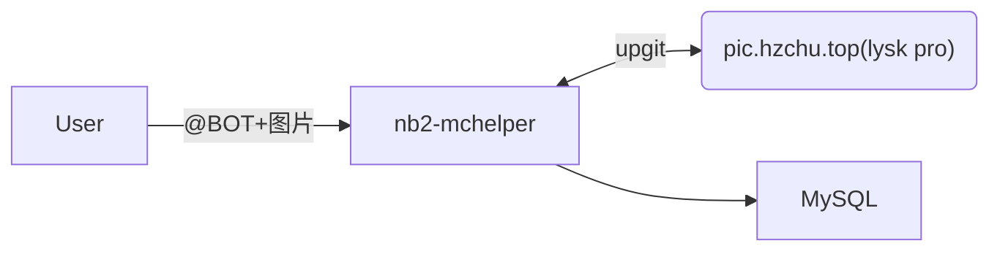
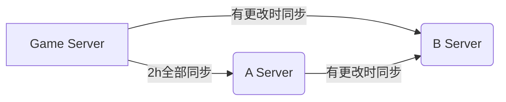

## 前言
​	2023年的暑假，在我百般无聊之际，网上冲浪时刷到了一个 mc服务器的视频。于是呼，心里萌发了一个想法——建立一个属于自己的服务器。在考虑的各种因素后，我选择了“纯生存”这个主题（之前都是玩命令的，很少沉下心来好好玩玩生存，也算是圆个心愿吧）。然后嘛，路走窄了，因为`时机不恰当，稳定性欠佳，玩法单调`等致命负面因素，好嘛，~~它没了~~（还活着，但在线玩家数量≤3罢了）。毕竟玩家数量跟投入的预算完全不成正比，没啥动力开，让我不禁想起了之前和酷安上一个老哥「[Ifkn_271](https://www.coolapk.com/u/1900578)」合作，结果也是这样消失在互联网茫茫大海之中。

​	不过话说回来，还是有投入了很多精力在上面的，时至今日，随着「go-cqhttp」项目寿终正寝，加上自己硬盘爆炸带来的数据库丢失，目前只剩下核心的游戏服务端还能用了，今天写一篇文章来~~追悼~~怀念一下吧。

## 内容索引

1. [MCDR插件及部分服务端配置](#游戏服务端)
2. [Dynmap设置MySQL存储及使用独立Web服务器](#Dynmap)
3. [在线服务平台程序解析及部分代码片段](#在线服务)
4. [QQ机器人中自动添加离线用户白名单、聊天信息同步及图片上传](#QQ-BOT)
5. [杂项](#杂项)


## 介绍
​	关于服务器的信息在[这里](/wiki/fcloud/)可以看
​	当然，在上面没有涉及到技术部分。总的来说，一共涉及到了「服务端主体及相应插件」，「网页前端、后端」 ，「QQ机器人」， 「Dynmap」这几个部分，大体架构如下


以上，听我慢慢道来


## 游戏服务端

这方面大家各有不同，我这也不是最优选，就一笔带过



​	由于当时没找到使用于fabric的登录插件，被迫增加了BC和一个独立的登录服务端。在前者我用了「Geyser」和「PixelMOTD」，一个用于转换be版于java版的通信协议，另一个用来处理motd请求，看起来更加高大上。后者用了雪之樱的整合包，并加了`BungeeAutoJoinServer`模组，在`Authme`登录事件结束后自动进入服务器。

​	虽然臃肿了点，但也有好处，比如`防假人压测，motd攻击`之类。







不懂Java，但又得对服务端运行做出干涉，这就得请出`MCDReforged`了




1. 清除掉落物

```python \mcdr_server\plugins\cleandrops.py
PLUGIN_METADATA = {
    'id': 'cleanitem',
    'version': '1.0.0',
    'name': '扫地僧'
}


from mcdreforged.api.all import *
import time

def clear_drops(server: PluginServerInterface):
    server.execute('tellraw @a {"text":"30秒后清除掉落物","color":"yellow"}')
    time.sleep(30)
    server.execute('kill @e[type=item]')
    server.execute('tellraw @a {"text":"掉落物已清除!","color":"yellow"}')

def on_info(server: PluginServerInterface, info: Info):
    if info.content == '!!cleardrops':
        clear_drops(server)

@new_thread(PLUGIN_METADATA['id'])
def on_load(server, old):
    while True:
        clear_drops(server)
        time.sleep(86400)

```

插件运行在新的线程中，~~可以放心睡~~。当然，最好还是用「[ClearDespawn](https://modrinth.com/mod/cleardespawn)」

2. 聊天记录统计

```python \mcdr_server\plugins\talk.py
PLUGIN_METADATA = {
    'id': 'talksave',
    'version': '1.0.0',
    'name': '记录玩家聊天记录'
}

#配置区域
DATABASE = {
    'host': '127.0.0.1',
    'user': 'user',
    'password': 'password',
    'database': 'database'
}

import mysql.connector
from mcdreforged.api.all import *
# def on_load(server, old):
#     server.logger.info('Hello world!')
def on_user_info(server: PluginServerInterface, info: Info):
    # 获取玩家名和聊天消息内容
    player = info.player
    message = info.content
    #server.logger.info(f'{player} 发送了消息：{message}')
    if player is None or message is None:
        return
    if message.startswith('!!MCDR') or message.startswith('!!plp') or message.startswith('!!day') or message =="stop" or message =="" or message.startswith('!!qb') or message.startswith('tellraw') or message.startswith('list'):
        return
    # 此部分判断是否为MCDR命令，可根据自己插件不同调整
    # 也可与nb联动，同步信息到qq，不过我手抖把代码删了
    conn= mysql.connector.connect(**DATABASE)
    cursor = conn.cursor()
    sql = "INSERT INTO chat (playername, msg, time) VALUES (%s, %s, NOW())"
    val = (player, message)
    cursor.execute(sql, val)
    conn.commit()
    cursor.close()
```

记录聊天记录到数据库，日后可以查询

3. 「银行」

用下界合金为货币，存储到数据库中，本想和商店搭配使用的，没写完就不放了



1. 既然是生存，必然绕不开一些生电类机器，~~无脑投入carpet的怀抱~~


2. Tab玩家列表用`styledplayerlist`微调了下


```json \server\config\styledplayerlist\styles\default.json
{
  "style_name": "Default",
  "update_tick_time": 20,
  "list_header": [
    "<gr:#ff6c00:#ff6c00><bold>峰间云海</bold></gr>",
    "<color:#555555><strikethrough>        </strikethrough>[ </color><color:#FF5555>%server:online%<color:#6666676>/</color>%server:max_players%</color><color:#555555> ]<strikethrough>        </strikethrough></color>"
  ],
  "list_footer": [
    "<color:#555555><strikethrough>                          </strikethrough></color>",
    "<gray>TPS: %server:tps_colored% <dark_gray>|</dark_gray><gray> MSPT: %server:mspt_colored% <dark_gray>|</dark_gray> <gray>RAM: <color:#54fc54>%server:used_ram%/%server:max_ram%MB</color> <dark_gray>|</dark_gray> <gray>Ping: <color:#ffba26>%player:ping%ms</color>",
    "<gray>游戏时间：%world:time% <dark_gray>|</dark_gray> <gray>现实时间：%server:time% <dark_gray>|</dark_gray> <gray>实体数量：%world:mob_count%"
  ],
  "hidden_in_commands": false
}
```

3. Simple Voice Chat

平时还有几条frp线路备用，而SVC默认使用`当前连接的ip+24454`进行连接，导致使用frp线路时无法使用，只好在配置里指定连接host

```properties \config\voicechat\voicechat-server.properties:29
# The host name that clients should use to connect to the voice chat
# This may also include a port, e.g. 'example.com:24454'
# Don't change this value if you don't know what you are doing
voice_host=mcvoice.hzchu.top\:24454
# 其它设置无需调整
```

其它就没什么改动了，添加的插件列表在[这里](/wiki/fcloud/)

## 外围应用



如官方简介里说的一样，这是一个`Google Maps-like map for your Minecraft server`，可以把服务器存档渲染成像谷歌地图般的在线网页供其他人查看


通常情况下，大部分人装好就直接用了，可能再反代一下默认的8123端口，定个自定义路径访问。不过聪明的你从上面的架构图中应该已经发现了不同。没看清？再看一次


为了实现上述访问流程，需要对原有设置做出一定调整

我参考了这篇文章，不过因为是外文翻译过来的，表达多少有点不太通顺，我就再复述一遍，~~绝对不是水字数~~。                                                                                                                                                                                                                                                                                                                                                                                                                                                                                                                                                                                                 



1. 首先先新建一个数据库，如果能设置允许访问范围的话最好只包括本机和服务端的ip

   

2. 修改以下配置

<!-- cell -->
**更改前**

```yaml \dynmap\configuration.txt:28
storage:
  # Filetree storage (standard tree of image files for maps)
  type: filetree
  # SQLite db for map storage (uses dbfile as storage location)
  #type: sqlite
  #dbfile: dynmap.db
  # MySQL DB for map storage (at 'hostname':'port' with flags "flags" in database 'database' using user 'userid' password 'password' and table prefix 'prefix')
  #type: mysql
  #hostname: localhost
  #port: 3306
  #database: dynmap
  #userid: dynmap
  #password: dynmap
  #prefix: ""
```

<!-- cell -->
**更改后**

```yaml \dynmap\configuration.txt:28
storage:
  # Filetree storage (standard tree of image files for maps)
  #type: filetree <- DONT FORGET TO COMMENT THIS OUT
  # SQLite db for map storage (uses dbfile as storage location)
  #type: sqlite
  #dbfile: dynmap.db
  # MySQL DB for map storage (at 'hostname':'port' with flags "flags" in database 'database' using user 'userid' password 'password' and table prefix 'prefix')
  type: mysql
  hostname: <mysql_ip>
  port: <mysql_port>
  database: <mysql_database>
  userid: <dynmap_mysql_user>
  password: <dynmap_mysql_password>
  prefix: "" # Can add prefix for tables if you want
```





随后，注释掉`- class: org.dynmap.InternalClientUpdateComponent`所有内容并**取消**注释`- class: org.dynmap.JsonFileClientUpdateComponent`所有内容




<!-- cell -->
**更改前**


```yaml \dynmap\configuration.txt:54
  - class: org.dynmap.InternalClientUpdateComponent
    sendhealth: true
    sendposition: true
    allowwebchat: true
    webchat-interval: 5
    hidewebchatip: true
    trustclientname: false
    includehiddenplayers: false
    # (optional) if true, color codes in player display names are used
    use-name-colors: false
    # (optional) if true, player login IDs will be used for web chat when their IPs match
    use-player-login-ip: true
    # (optional) if use-player-login-ip is true, setting this to true will cause chat messages not matching a known player IP to be ignored
    require-player-login-ip: false
    # (optional) block player login IDs that are banned from chatting
    block-banned-player-chat: true
    # Require login for web-to-server chat (requires login-enabled: true)
    webchat-requires-login: false
    # If set to true, users must have dynmap.webchat permission in order to chat
    webchat-permissions: false
    # Limit length of single chat messages
    chatlengthlimit: 256
  #  # Optional - make players hidden when they are inside/underground/in shadows (#=light level: 0=full shadow,15=sky)
  #  hideifshadow: 4
  #  # Optional - make player hidden when they are under cover (#=sky light level,0=underground,15=open to sky)
  #  hideifundercover: 14
  #  # (Optional) if true, players that are crouching/sneaking will be hidden 
    hideifsneaking: false
    # If true, player positions/status is protected (login with ID with dynmap.playermarkers.seeall permission required for info other than self)
    protected-player-info: false
    # If true, hide players with invisibility potion effects active
    hide-if-invisiblity-potion: true
    # If true, player names are not shown on map, chat, list
    hidenames: false
  #- class: org.dynmap.JsonFileClientUpdateComponent
  #  writeinterval: 1
  #  sendhealth: true
  #  sendposition: true
  #  allowwebchat: true
  #  webchat-interval: 5
  #  hidewebchatip: false
  #  includehiddenplayers: false
  #  use-name-colors: false
  #  use-player-login-ip: false
  #  require-player-login-ip: false
  #  block-banned-player-chat: true
  #  hideifshadow: 0
  #  hideifundercover: 0
  #  hideifsneaking: false
  #  # Require login for web-to-server chat (requires login-enabled: true)
  #  webchat-requires-login: false
  #  # If set to true, users must have dynmap.webchat permission in order to chat
  #  webchat-permissions: false
  #  # Limit length of single chat messages
  #  chatlengthlimit: 256
  #  hide-if-invisiblity-potion: true
  #  hidenames: false
```

<!-- cell -->
**更改后**

```yaml \dynmap\configuration.txt:54
 # - class: org.dynmap.InternalClientUpdateComponent
    #sendhealth: true
    #sendposition: true
    #allowwebchat: true
    #webchat-interval: 5
    #hidewebchatip: false
    #trustclientname: false
    #includehiddenplayers: false
    # (optional) if true, color codes in player display names are used
    #use-name-colors: false
    # (optional) if true, player login IDs will be used for web chat when their IPs match
    #use-player-login-ip: true
    # (optional) if use-player-login-ip is true, setting this to true will cause chat messages not matching a known player IP to be ignored
    #require-player-login-ip: false
    # (optional) block player login IDs that are banned from chatting
    #block-banned-player-chat: true
    # Require login for web-to-server chat (requires login-enabled: true)
    #webchat-requires-login: false
    # If set to true, users must have dynmap.webchat permission in order to chat
    #webchat-permissions: false
    # Limit length of single chat messages
    #chatlengthlimit: 256
  #  # Optional - make players hidden when they are inside/underground/in shadows (#=light level: 0=full shadow,15=sky)
  #  hideifshadow: 4
  #  # Optional - make player hidden when they are under cover (#=sky light level,0=underground,15=open to sky)
  #  hideifundercover: 14
  #  # (Optional) if true, players that are crouching/sneaking will be hidden 
    #hideifsneaking: false
    # If true, player positions/status is protected (login with ID with dynmap.playermarkers.seeall permission required for info other than self)
    #protected-player-info: false
    # If true, hide players with invisibility potion effects active
    #hide-if-invisiblity-potion: true
    # If true, player names are not shown on map, chat, list
    #hidenames: false
  - class: org.dynmap.JsonFileClientUpdateComponent
    writeinterval: 1
    sendhealth: true
    sendposition: true
    allowwebchat: true
    webchat-interval: 5
    hidewebchatip: false
    includehiddenplayers: false
    use-name-colors: false
    use-player-login-ip: false
    require-player-login-ip: false
    block-banned-player-chat: true
    hideifshadow: 0
    hideifundercover: 0
    hideifsneaking: false
  #  # Require login for web-to-server chat (requires login-enabled: true)
    webchat-requires-login: false
  #  # If set to true, users must have dynmap.webchat permission in order to chat
    webchat-permissions: false
  #  # Limit length of single chat messages
    chatlengthlimit: 256
    hide-if-invisiblity-potion: true
    hidenames: false
```





然后找到`disable-webserver`并将值从`false`更改为 `true` 以禁用内部网页服务器


再修改相应的请求地址（`url:`）

<!-- cell -->
**更改前**


```yaml \dynmap\configuration.txt:441
url:
    # configuration URL
    #configuration: "up/configuration"
    # update URL
    #update: "up/world/{world}/{timestamp}"
    # sendmessage URL
    #sendmessage: "up/sendmessage"
    # login URL
    #login: "up/login"
    # register URL
    #register: "up/register"
    # tiles base URL
    #tiles: "tiles/"
    # markers base URL
    #markers: "tiles/"
```

<!-- cell -->
**MySQL**


```yaml \dynmap\configuration.txt:441
url:
    # configuration URL
    configuration: "standalone/MySQL_configuration.php"
    # update URL
    update: "standalone/MySQL_update.php?world={world}&ts={timestamp}"
    # sendmessage URL
    sendmessage: "standalone/MySQL_sendmessage.php"
    # login URL
    login: "standalone/MySQL_login.php"
    # register URL
    register: "standalone/MySQL_register.php"
    # tiles base URL
    tiles: "standalone/MySQL_tiles.php?tile="
    # markers base URL
    markers: "standalone/MySQL_markers.php?marker="
```

<!-- cell -->
**SQLite**


```yaml \dynmap\configuration.txt:441
url:
    # configuration URL
    configuration: "standalone/configuration.php"
    # update URL
    update: "standalone/update.php?world={world}&ts={timestamp}"
    # sendmessage URL
    sendmessage: "standalone/sendmessage.php"
    # login URL
    login: "standalone/login.php"
    # register URL
    register: "standalone/register.php"
    # tiles base URL
    tiles: "standalone/tiles.php?tile="
    # markers base URL
    markers: "standalone/markers.php?marker="
```





最后修改一下配置文件中前端的地址（会在游戏中显示）

```yaml \dynmap\configuration.txt:478
# Published public URL for Dynmap server (allows users to use 'dynmap url' command to get public URL usable to access server
# If not set, 'dynmap url' will not return anything.  URL should be fully qualified (e.g. https://mc.westeroscraft.com/)
publicURL: https://yourdomain.com/
```


3. 安装用于MySQL的java驱动包



下载后放入 `mods` 文件夹

4. 试运行

​	开启服务端，观察日志输出中有无报错，同时检查数据库中是否有数据表生成


5. 成功运行后配置网页前端。先安装PHP-7.4（实测8.0会存在bug无法登录），将`...\dynmap\web`下所有文件复制到网页根目录即可。（模组在启动后会自动完成配置，以配置mysql为存储为例，配置会写入 `\standalone\config.js`和 `\web\standalone\MySQL_config.php`）如果数据库无法访问可测试手动设置`$dbhost`为`127.0.0.1`


6. 打开看看吧~ 哦？一片漆黑，因为这时候还没有执行渲染命令，dynmap还没工作，因此我们可以执行 `/dynmap radiusrender world 0 0 10`来对主世界出生点周围进行渲染，并查看中有无数据写入到`tiles`表中


初步测试完成后就可以执行 `/dynmap fullrender world` 渲染整个世界了。







> [峰间云海 (hzchu.top)](https://mcweb.hzchu.top/)

与其叫做官网，倒不如说是一个 `综合服务平台` ， 当初想着与其整个花里胡哨的页面，不如整个有用的。虽然事实证明还是花哨的好。

1. 前端

因为当时赶工期， 从头学各种框架来不及，用Py写了个拼凑html的程序，基本能用，后面MRUI也延续了这套，后续如果有空改进下。



基本是开箱即用了

功能在后面混着讲

2. 后端

**首页：**状态检测使用了`mcstatus`库，具体操作可以参考[mcstatus · PyPI](https://pypi.org/project/mcstatus/)。公告用了Artalk，~~歪门邪道~~

**聊天记录：**

```python main.py
@app.route('/user/msg', methods=['GET'])
def getmsg():
    num = request.args.get('num', default=0, type=int)
    # 限制访问前200条记录
    if num > 160:
        messages = []
        message = {
            'id': 0,
            'playername': "Null",
            'msg': "200条后不予查看",
            'time': "Null"
        }
        messages.append(message)
        return jsonify(messages), 200
    conn= mysql.connector.connect(**DATABASE)
    cursor = conn.cursor()
    sql = "SELECT id, playername, msg, time FROM chat ORDER BY id DESC LIMIT %s, %s"
    cursor.execute(sql, (num, 40))
    result = cursor.fetchall()
    cursor.close()

    messages = []
    for row in result:
        message = {
            'id': row[0],
            'playername': row[1],
            'msg': row[2],
            'time': row[3].strftime('%Y-%m-%d %H:%M:%S')
        }
        messages.append(message)

    return jsonify(messages), 200
```

在前端页面中，我是直接用了表格的形式显示，不够好看，原草稿大概是这样，~~可惜没时间~~


**相册：**

这部分与前者差不多，前端网上随便找了个改了改

> 此部分仅为读取，写入的部分由QQ机器人负责

```python main.py
@app.route('/user/photo', methods=['GET'])
def get_data():
    num = request.args.get('num', default=0, type=int)
    
    conn= mysql.connector.connect(**DATABASE)
    cursor = conn.cursor()
    
    try:
        query = "SELECT id, nickname, author, time, url FROM photo ORDER BY id DESC LIMIT %s, %s"
        cursor.execute(query, (num, 24))
        results = cursor.fetchall()
        
        # 将查询结果转换为字典列表
        data = []
        for row in results:
            data.append({
                'id': row[0],
                'nickname': row[1],
                'author': row[2],
                'time': row[3],
                'url': row[4]
            })
        
        return jsonify(data)
    
    except Exception as e:
        return jsonify({'error': str(e)})
    
    finally:
        cursor.close()
        conn.close()
```

**坐标&反馈：**缩水了，用Artalk替代了，只能说与我计划中差的有亿点多

**排行榜：**

​	这就有点意思了，为了实现这些数据统计，我在游戏中新建了`若干的计分板`+一些在常加载区块里的`命令方块`，随后每隔一段时间读取存档里的存储着计分板数据的文件（\world\data\scoreboard.dat），将数值计入数据库。（起初使用Rcon执行命令显示该玩家所有计分板数据并使用正则表达式提取再存入，前期还好，到后来影响太大被迫改进）

​	游戏里的命令就不说了，需求不一定相同，网上一大把教程



​	在实际程序中，为了简化主程序的复杂程度（拉侧边滚动条都拉出火花了），我把新定义的函数放在`extra.py`里

```python extra.py
import mysql.connector
import python_nbt.nbt as nbt
import json
import time

def get_scoreboard(scoreboard_name):
# 将字符串转换为 Python 对象
    start_time = time.time()
    file = nbt.read_from_nbt_file("D:\MCC\mcdr_server\server\world\data\scoreboard.dat")
    string_data = str(file)
    # print(string_data)
    python_object = ast.literal_eval(string_data)

    # 将 Python 对象转换为 JSON 字符串
    json_data = json.dumps(python_object)
    data = json.loads(json_data)
    # print(json_data)
    # print(data["value"]["data"]["value"]["PlayerScores"]["value"])
    data = data["value"]["data"]["value"]["PlayerScores"]["value"]
    for i in data:
        if i["Objective"]["value"] == scoreboard_name:
            name = i["Name"]["value"]
            score = i["Score"]["value"]
            #print(name,":",score)
            conn= mysql.connector.connect(**DATABASE)
            cursor = conn.cursor()
            
            try:
                insert_query = "INSERT INTO scoreboard (player, {}) VALUES (%s, %s) ON DUPLICATE KEY UPDATE {} = %s".format(scoreboard_name, scoreboard_name)
                data = (name, score, score)
                cursor.execute(insert_query, data)

                conn.commit()
            
            except Exception as e:
                print(str(e))
            
            finally:
                cursor.close()
                conn.close()


    # 记录结束时间
    end_time = time.time()

    # 计算执行时间
    execution_time = end_time - start_time

    # 打印执行时间
    return(execution_time)
```

​	该函数回返回执行时间，不过没用错误处理，虽然一般情况下不会发生错误，不过最好也改进下再用

```python main.py
import threading
import time
import extra

def updatabase():
    time_used = extra.get_scoreboard("pickaxe_total")
    time_used = time_used + extra.get_scoreboard("gametime")
    time_used = time_used + extra.get_scoreboard("Kills")
    time_used = time_used + extra.get_scoreboard("fish")
    time_used = time_used + extra.get_scoreboard("xp")
    time_used =" {:.3f}".format(time_used)
    #msg_type = "System-AutoTasks"
    #msg_value = "计分板同步成功，耗时:" + str(time_used) + "秒"
    #extra.eventssave(msg_type,msg_value)
    # 用于日志保存，可去掉
                          
                  
def run_timer():
    while True:
        # 每2h执行一次
        # 简单粗暴，实际使用请使用schedule库
        time.sleep(2* 60 * 60)
        # 在后台线程中执行需要定时执行的函数
        threading.Thread(target=updatabase).start()

```

通过以下路由返回数据

```python main.py
@app.route('/user/scoreboard')
def get_scoreboard():
    cnx = mysql.connector.connect(**DATABASE)
    cursor = cnx.cursor()
    query = "SELECT * FROM scoreboard"
    cursor.execute(query)
    data = [{'playername': row[0], 'pickaxe_total': row[1], 'gametime': row[2], 'Kills': row[3], 'fish': row[4], 'xp': row[5]} for row in cursor.fetchall()]
    cursor.close()
    return jsonify(data)
```

前端用了AI帮忙，太折磨人了。



```javascript list.js
const scoreboardUrl = 'https://***************/user/scoreboard';
const scoreboardBodyPickaxe = document.getElementById('scoreboard-body-pickaxe');
const scoreboardBodyKills = document.getElementById('scoreboard-body-kills');
const scoreboardBodyFish = document.getElementById('scoreboard-body-fish');
const scoreboardBodyGametime = document.getElementById('scoreboard-body-gametime');
const scoreboardBodyxp = document.getElementById('scoreboard-body-xp');
fetch(scoreboardUrl)
    .then(response => response.json())
    .then(scoreboard => {
        //定义一个比较函数，按照pickaxe_total的大小从高到低排序
        function compareByPickaxe(a, b) {
            return b.pickaxe_total - a.pickaxe_total;
        }

        //定义一个比较函数，按照Kills的大小从高到低排序
        function compareByKills(a, b) {
            return b.Kills - a.Kills;
        }

        //定义一个比较函数，按照fish的大小从高到低排序
        function compareByFish(a, b) {
            return b.fish - a.fish;
        }

        //定义一个比较函数，按照gametime的大小从高到低排序
        function compareByGametime(a, b) {
            return b.gametime - a.gametime;
        }

        //定义一个比较函数，按照xp的大小从高到低排序
        function compareByxp(a, b) {
            return b.xp - a.xp;
        }
        //定义一个过滤函数，排除掉pickaxe_total为0的玩家
        function filterByPickaxe(a) {
            return a.pickaxe_total > 0;
        }

        //定义一个过滤函数，排除掉Kills为null的玩家
        function filterByKills(a) {
            return a.Kills != null;
        }

        //定义一个过滤函数，排除掉fish为null的玩家
        function filterByFish(a) {
            return a.fish != null;
        }

        //定义一个过滤函数，排除掉gametime为null的玩家
        function filterByGametime(a) {
            return a.gametime != null;
        }
        //定义一个过滤函数，排除掉xp为null的玩家 
        function filterByxp(a) {
            return a.xp != null;
        }
        //对scoreboard数组进行过滤
        scoreboard = scoreboard.filter(filterByPickaxe);
        // 参照最初版重写！！！！
        //创建一个副本数组，按照pickaxe_total排序
        let scoreboardByPickaxe = [...scoreboard];
        scoreboardByPickaxe.sort(compareByPickaxe);
        console.log(scoreboardByPickaxe)

        //创建一个副本数组，按照Kills排序，并过滤掉null值
        let scoreboardByKills = [...scoreboard];
        scoreboardByKills.sort(compareByKills);
        scoreboardByKills = scoreboardByKills.filter(filterByKills);

        //创建一个副本数组，按照fish排序，并过滤掉null值
        let scoreboardByFish = [...scoreboard];
        scoreboardByFish.sort(compareByFish);
        scoreboardByFish = scoreboardByFish.filter(filterByFish);


        //创建一个副本数组，按照gametime排序，并过滤掉null值
        let scoreboardByGametime = [...scoreboard];
        scoreboardByGametime.sort(compareByGametime);
        scoreboardByGametime = scoreboardByGametime.filter(filterByGametime);
        //创建一个副本数组，按照xp排序，并过滤掉null值 
        let scoreboardByXp = [...scoreboard];
        scoreboardByXp.sort(compareByxp);
        scoreboardByXp = scoreboardByXp.filter(filterByxp);
        //遍历按照pickaxe_total排序的数组，创建表格行和单元格，并添加到对应的表格中
        scoreboardByPickaxe.forEach((player, index) => {
            const row = document.createElement('tr');
            const rank = document.createElement('td');
            const playerName = document.createElement('td');
            const pickaxeTotal = document.createElement('td');

            rank.textContent = index + 1;
            playerName.textContent = player.playername;
            pickaxeTotal.textContent = player.pickaxe_total;

            row.appendChild(rank);
            row.appendChild(playerName);
            row.appendChild(pickaxeTotal);

            scoreboardBodyPickaxe.appendChild(row);
        });

        //遍历按照Kills排序的数组，创建表格行和单元格，并添加到对应的表格中
        scoreboardByKills.forEach((player, index) => {
            const row = document.createElement('tr');
            const rank = document.createElement('td');
            const playerName = document.createElement('td');
            const kills = document.createElement('td');

            rank.textContent = index + 1;
            playerName.textContent = player.playername;
            kills.textContent = player.Kills;

            row.appendChild(rank);
            row.appendChild(playerName);
            row.appendChild(kills);

            scoreboardBodyKills.appendChild(row);
        });

        //遍历按照fish排序的数组，创建表格行和单元格，并添加到对应的表格中
        scoreboardByFish.forEach((player, index) => {
            const row = document.createElement('tr');
            const rank = document.createElement('td');
            const playerName = document.createElement('td');
            const fish = document.createElement('td');

            rank.textContent = index + 1;
            playerName.textContent = player.playername;
            fish.textContent = player.fish;

            row.appendChild(rank);
            row.appendChild(playerName);
            row.appendChild(fish);

            scoreboardBodyFish.appendChild(row);
        });

        //遍历按照gametime排序的数组，创建表格行和单元格，并添加到对应的表格中
        scoreboardByGametime.forEach((player, index) => {
            const row = document.createElement('tr');
            const rank = document.createElement('td');
            const playerName = document.createElement('td');
            const gametime = document.createElement('td');

            rank.textContent = index + 1;
            playerName.textContent = player.playername;
            gametime.textContent = Math.floor(player.gametime / 60 / 60) + "h";


            row.appendChild(rank);
            row.appendChild(playerName);
            row.appendChild(gametime);

            scoreboardBodyGametime.appendChild(row);
        });
        //遍历按照xp排序的数组，创建表格行和单元格，并添加到对应的表格中 
        scoreboardByXp.forEach((player, index) => {
            const row = document.createElement('tr');
            const rank = document.createElement('td');
            const playerName = document.createElement('td');
            const xp = document.createElement('td');

            rank.textContent = index + 1;
            playerName.textContent = player.playername;
            xp.textContent = getLevel(player.xp);

            row.appendChild(rank);
            row.appendChild(playerName);
            row.appendChild(xp);

            scoreboardBodyxp.appendChild(row);
        });
    });
// 定义一个函数，参数为原始经验值
function getLevel(exp) {
    // 定义一个变量，存储经验等级
    let level = 0;
    // 定义一个变量，存储升级所需的经验值
    let expToNext = 0;
    // 使用循环，不断更新经验等级和升级所需的经验值，直到原始经验值不足以升级为止
    while (true) {
        // 根据公式，计算升级所需的经验值
        if (level <= 15) {
            expToNext = 2 * level + 7;
        } else if (level <= 30) {
            expToNext = 5 * level - 38;
        } else {
            expToNext = 9 * level - 158;
        }
        // 判断原始经验值是否足够升级
        if (exp >= expToNext) {
            // 如果足够，减去升级所需的经验值，增加经验等级
            exp -= expToNext;
            level++;
        } else {
            // 如果不足，跳出循环
            break;
        }
    }
    // 返回经验等级
    return level;
}
```



**管理：**

如果内建账号密码登录，要增加一些工作量，所以我借鉴了一下之前某个AIGC平台的做法，向qq机器人发信息以获取有效期一周的token用于登录，这样安全性大大提高，而且写起来也不用顾虑太多。在初次打开时网页会发送鉴权请求判断是否有效，后续请求也都带上这个token。以下是部分代码片段

```python 封禁玩家
@app.route('/admin/banplayer', methods=['POST'])
def banplayer():
    playername = request.json.get('playername')
    reason = request.json.get('reason')
	...
    if reason == "":
        reason = "未记录原因的封禁，请联系管理员"

    command = 'kick ' + playername + ' ' + reason
    response = extra.sendcommand(command)
    command = 'ban ' + playername + ' ' + reason
    response = extra.sendcommand(command)
    conn = mysql.connector.connect(**DATABASE)
	...

    return jsonify({'code':0,'response': response}), 200
```

```python extra.py
import mcrcon

# 主机 密码 端口
client = mcrcon.MCRcon('127.0.0.1', '*-*-*-*', 2****5)
client.connect()
def sendcommand(command):
    if not command:
        return {'error': 'No command provided'}
    
    response = client.command(command)
    return response
```

```python 解除封禁
@app.route('/admin/debanplayer', methods=['POST'])
def debanplayer():
    playername = request.json.get('playername')
	...
    command = 'pardon ' + playername
    response = extra.sendcommand(command)
    conn = mysql.connector.connect(**DATABASE)
	...
    return jsonify({'code':0,'response': response}), 200
```

```python 获取用户信息
import ipdb

@app.route('/admin/getaccount', methods=['POST'])
def getaccount():
    accountinfo = request.json.get('accountinfo')
    mode = int(request.json.get('mode'))
	...
    conn = mysql.connector.connect(**DATABASE)
    c = conn.cursor()
    if mode == 1:
        c.execute("SELECT * FROM `qq_user` where qq_id = %s", (accountinfo,))
    elif mode == 2:
        c.execute("SELECT * FROM `qq_user` where user_name = %s", (accountinfo,))
    elif mode == 3:
        c.execute("SELECT * FROM `qq_user` where be_name = %s", (accountinfo,))
    else:
        c.execute("SELECT * FROM `qq_user` where qq_id = %s", (accountinfo,))
    acc_result = c.fetchall()

    
    if acc_result:
        if acc_result[0][5] is None:
            be_name = "!未绑定!"
        else:
            be_name = acc_result[0][5]
        playername = acc_result[0][1]
        # 用的MySQL数据库，Authme和该服务共用一个数据库，因此直接调用其获取IP
        c.execute("SELECT * FROM `authme` where realname = %s or username = %s", (playername,playername,))
        ip_result = c.fetchall()
        conn.close()
        #嵌套有点多，整活部分可以改掉
        if ip_result:
            ip = ip_result[0][4]
            if ipaddress.ip_address(ip).is_private:
                ip = "内网地址"
                country="南极洲"
                city="中山站"
            else:
                ipinfo=db.find_map(ip, "CN")
                country=ipinfo["country_name"]
                city= ipinfo["region_name"]+"，"+ipinfo["city_name"]
        else:
            ip = "!未记录在数据库!"
            country="北极点"
            city="鹦鹉螺号"
        return jsonify({'code':0,'qq': acc_result[0][0],'user_name': playername,'bind_time': acc_result[0][2],'group': acc_result[0][3],'status': acc_result[0][4],'be_name': be_name,'ip': ip,'country':country,'city':city}), 200
    else:
        conn.close()
        return jsonify({'code':1000,'msg': '没有相应玩家消息'}), 200
```




在整个规划中，它承担了相当重要的责任，譬如自动添加白名单（绑定）


 

**绑定：**一开始我使用了一个极为简单的绑定方式：通过Rcon连接到服务器执行 `whitelist add playername`，按理来说这没问题，但是后面来的玩家基本都在抱怨进不去服务器。错误截图都一样，不在白名单内。最后发现uuid不一致，有些人的离线用户名与某些正版用户名重复了，导致服务端直接沿用正版用户的uuid，过不去后续校验。所以我这里就直接计算离线用户的uuid写入到`whitelist.json`内

```python mchelper\__init__.py
@bind.handle()
async def handle_first_receive(matcher: Matcher, args: Message = CommandArg()):
    plain_text = args.extract_plain_text()  # 首次发送命令时跟随的参数，例：/绑定 username，则args为username
    if plain_text:
        matcher.set_arg("username", args)  # 如果用户发送了参数则直接赋值


@bind.got("username", prompt="请输入你的用户名")
async def handle_username(event: GroupMessageEvent, username: Message = Arg(), username_str: str = ArgPlainText("username")):
    username = str(username)
    user_id = event.user_id

    pattern = r'^[a-zA-Z0-9_]+$'
    if re.match(pattern, username):
        pass
    else:
        extra.settimeout()
        await bind.finish(f"用户名只可以包括英文字母，数字，下划线")
	...
    binduser(username)
	...

    await bind.finish(f"{username} 绑定成功（若仍无法进入服务器，可尝试发送“正常流程绑定”）")
    # 即用whitelist add
            
def binduser(playername):
    offline_uuid = str(extra.touuid(playername))
    #offline_uuid = offline_uuid_raw[:8] + "-" + offline_uuid_raw[8:12] + "-" + offline_uuid_raw[12:16] + "-" + offline_uuid_raw[16:20] + "-" + offline_uuid_raw[20:]
    #读取 ***\whitelist.json,找到playername对应的uuid，用offline_uuid替换
    whitelist_file_path = r"Z:\server\whitelist.json"
    with open(whitelist_file_path, "r", encoding="utf-8") as f:
        data = json.load(f)

    # 先尝试是否能找到对应玩家名称的条目，并替换uuid字段，如果没有，则新增
    found = False # 定义一个变量，用来标记是否找到了对应的玩家条目
    for player in data:
        if player["name"] == playername:
            player["uuid"] = offline_uuid # 替换uuid字段
            found = True # 将变量设为True，表示找到了对应的玩家条目
            break # 跳出循环，不再继续查找
    if not found: # 如果变量为False，表示没有找到对应的玩家条目
        data.append({"name": playername, "uuid": offline_uuid}) # 在data列表中添加一个新的字典，包含玩家的名字和uuid

    # 将修改后的内容写回whitelist.json文件
    with open(whitelist_file_path, "w", encoding="utf-8") as f:
        json.dump(data, f)
    # 调用外部命令来重载白名单
    client.connect()
    command = "whitelist reload"
    response = client.command(command)
    client.disconnect()

```

```python mchelper\extra.py
import hashlib
import uuid

#该函数用于计算离线用户的uuid
def touuid(name):
    name = "OfflinePlayer:" + name
    md5 = hashlib.md5()
    md5.update(name.encode('utf-8'))
    md5_bytes = md5.digest()

    md5_bytes = bytearray(md5_bytes) 

    md5_bytes[6] &= 0x0f
    md5_bytes[6] |= 0x30
    md5_bytes[8] &= 0x3f
    md5_bytes[8] |= 0x80 

    return uuid.UUID(bytes=bytes(md5_bytes))

```

**解绑：**其实差不了多少

```python mchelper\__init__.py
def debinduser(playername):
    offline_uuid = str(extra.touuid(playername))
    whitelist_file_path = r"Z:\server\whitelist.json"
    with open(whitelist_file_path, "r", encoding="utf-8") as f:
        data = json.load(f)

    for player in data:
        if player["name"] == playername:
            data.remove(player) # 移除该条目

    # 将修改后的内容写回whitelist.json文件
    with open(whitelist_file_path, "w", encoding="utf-8") as f:
        json.dump(data, f)
    # 调用外部命令来重载白名单
    client.connect()
    command = "whitelist reload"
    response = client.command(command)
    client.disconnect()
```

**图片上传：**



```python mchelper\__init__.py
upphoto = on_message(rule=to_me(), priority=5, block=True)

@upphoto.handle()
async def handle_upphoto(bot: Bot, event: GroupMessageEvent, state: T_State):
    user_id = event.user_id
    message = str(event.get_message())
    conn = mysql.connector.connect(**DATABASE)

    # print(message)
    if message:
        if matches:
            pattern = r"\[CQ:image,file=\w+\.image,subType=\d+,url=(https?://\S+?)]"
            matches = re.findall(pattern, message)
            current_time = time.strftime("%Y-%m-%d %H:%M:%S", time.localtime(time.time()))
            # print(matches)
            for match in matches:
                # print(match)
                
                file_name =  str(user_id) + str(time.time() * 1000)+".jpg"
                save_path = './tmp/' + file_name
                response = requests.get(match, stream=True)
                if response.status_code == 200:
                    with open(save_path, 'wb') as file:
                        for chunk in response.iter_content(1024):
                            file.write(chunk)
                    path = "Z:\\nb2\\mc\\tmp\\" + file_name
                    response = extra.upload_image(path)
                    if response.startswith("https://"):
                        url = response
                        c = conn.cursor()
                        c.execute("INSERT INTO photo VALUES (%s,%s,%s,%s,%s)", (None, str(event.sender.card),user_id, current_time, url))
                        conn.commit()
                    else:
                        conn.disconnect()
                        await upphoto.finish("上传失败（调用上传工具错误）")
                    os.remove(path)
                else:
                    conn.disconnect()
                    await upphoto.finish("上传失败(请求图片错误)")
            conn.disconnect()
            await upphoto.finish("上传成功")
        else:
            conn.disconnect()
            return  # 没有图片链接，不执行回复操作
```

**聊天记录同步：**

```python send\__init__.py
from nonebot import on_message, logger
from nonebot.adapters.onebot.v11 import GroupMessageEvent, Bot,MessageSegment
from nonebot.rule import startswith
from nonebot import get_driver
import mcrcon
import threading
import time
import re


msg_matcher = on_message(priority=10, block=False)
client = mcrcon.MCRcon('127.0.0.1', '******', 2***5)


def sendcommand(command):
    response = client.command(command)
    return response

@msg_matcher.handle()
async def _(bot: Bot, event: GroupMessageEvent):
    if event.group_id == 790118052:
        nick = str(event.sender.card)
        if nick == "":
            nick = str(event.sender.nickname)
        msg = nick+":"+replace(event.message)
        qqqq = "[Q群]"
        msg =f'[{{"text":"{qqqq}","color":"gold"}},{{"text":"{msg}","color":"white"}}]'
        command=f"tellraw @a [{msg}]"
        # print(command)
        sendcommand(command)

# 定义一个函数，接受一个文本参数，返回替换后的文本
def replace(text):
  text = str(text)

  image_pattern = r"\[CQ:image,file=.+?image,subType=0,url=.+?\]"

  at_pattern = r"\[CQ:at,qq=\d+\]"

  picface_pattern = r"\[CQ:image,file=.+?image,subType=1,url=.+?\]"
  face_pattern = r"\[CQ:face,id=.+?]"

  record_pattern = r"\[CQ:record,file=.+?amr,url=.+?\]"
  redbag_pattern = r"\[CQ:redbag,title=.+?\]"
  shit_pattern = r"请使用最新版手机QQ体验新功能"

  result = re.sub(image_pattern, "[图片]", text)

  result = re.sub(picface_pattern, "[图片表情]", result)
  result = re.sub(face_pattern, "[表情]", result)
  result = re.sub(at_pattern, "@", result)

  result = re.sub(record_pattern, "[语音]", result)

  result = re.sub(redbag_pattern, "[红包]", result)

  result = re.sub(shit_pattern, "不支持的信息类型", result)
  result = result.replace("<", "《").replace(">", "》")
  # 返回替换后的结果
  return result

def connectagain():
    client.connect()


def run_timer():
    while True:
        # 每5分钟执行一次
        time.sleep(5 * 60)
        # 在后台线程中执行需要定时执行的函数
        threading.Thread(target=connectagain).start()
# 避免重复执行使得后台刷屏
connectagain()
timer_thread = threading.Thread(target=run_timer)
timer_thread.daemon = True
timer_thread.start()
```




1. 备份相关：

由于之前存档炸过一次，相关的备份措施也随之建立起来。可分为主动式和被动式。主动式嘛，好说，不就是手动关掉自动保存然后压缩到一个独立硬盘嘛

被动的话就是用Syncthing进行单向同步，目前，我设置了2台设备用于备份



也用过git，但同步太耗性能了，遂放弃

## 结语

​	逝去的事物，只是换了个形式陪伴在你我身边。
